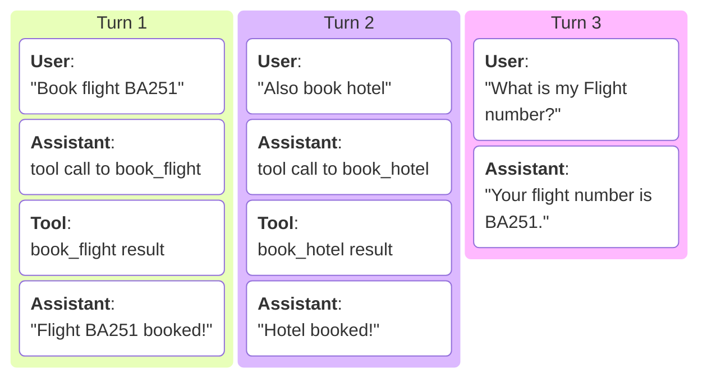

# Session ID and Multi-turn Sessions

In Sequrity Control API, the **session ID** allows maintaining context across multiple interactions in a chat session. This is particularly useful for enforcing security policies that depend on the sequence of tool calls made during a session.

**Turn**: Each turn consists of one user message, arbitrary assistant tool calls and tool results, ending with one final assistant response.



**Single-turn**: By default, Sequrity Control's session has a maximum lifetime of one turn, thus the session id becomes invalid after one turn. In single-turn sessions,
the session context is not retained for subsequent requests after a cycle of `[user request] -> [assistant tool calls] -> [tool result] -> [assistant tool calls] -> ... -> [final response]`.

**Multi-turn**: To enable multi-turn sessions, you need to explicitly configure the maximum number of turns allowed in a session.

- For Sequrity client, you can set [`max_n_turns` in `FineGrainedConfigHeader`][sequrity_api.types.control.headers.FineGrainedConfigHeader.max_n_turns] to a value greater than `1`.

    ```python
    from sequrity_api.types.control.headers import FineGrainedConfigHeader

    fine_grained_config = FineGrainedConfigHeader(max_n_turns=5)
    ```
- For REST API, you need to set [`max_n_turns` in your security config](../reference/rest_api/headers/security_config.md#max_n_turns) to a value greater than `1`.

    ```http
    X-Security-Config: {"max_n_turns": 5}
    ```

