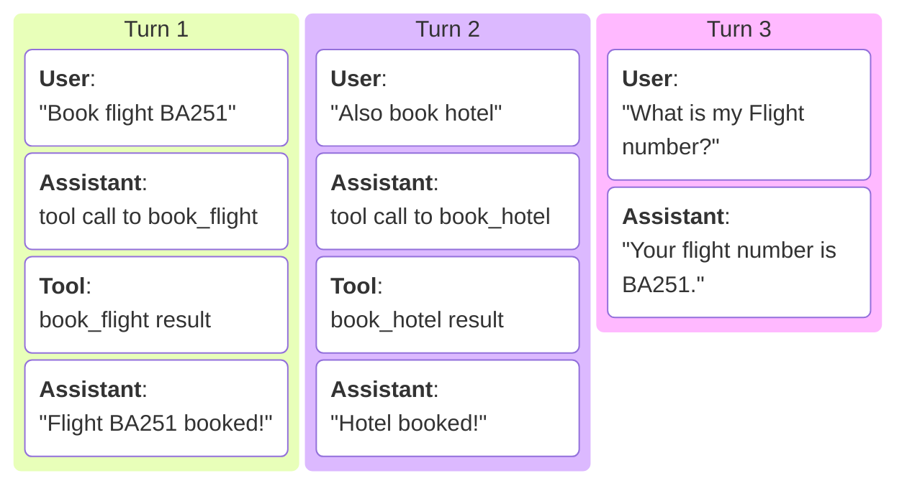

# Session ID and Multi-turn Sessions

In Sequrity Control API, the **session ID** allows maintaining context across multiple interactions in a chat session.
This is particularly useful for enforcing security policies that depend on the sequence of tool calls made during a session.

**Turn**: Each turn consists of one user message, arbitrary assistant tool calls and tool results, ending with one final assistant response.



**Single-turn**: By default, Sequrity Control's session has a maximum lifetime, thus the session id becomes invalid when the session exceeds the maximum lifetime. For example, in single-turn sessions (`max_n_turns=1`),
the session is removed after a cycle of `[user request] -> [assistant tool calls] -> [tool result] -> [assistant tool calls] -> ... -> [final response]`.

**Multi-turn**: To enable multi-turn sessions, you need to configure the maximum number of turns allowed in a session.

- For Sequrity client, you can set `max_n_turns` in `FineGrainedConfigHeader` to a value greater than `1`.

    ```python
    from sequrity.control import FineGrainedConfigHeader
    from sequrity.control.types.headers import FsmOverrides

    fine_grained_config = FineGrainedConfigHeader(fsm=FsmOverrides(max_n_turns=5))
    ```
- For REST API, you need to set `max_n_turns` in the `fsm` section of your `X-Config` header to a value greater than `1`.

    ```http
    X-Config: {"fsm": {"max_n_turns": 5}}
    ```

There are also other mechanisms to control session lifetime, such as the maximum number of tool calls issued in a step/attempt, the maximum number of steps in a turn, the maximum number of failed steps in a turn, etc. You can refer to [the documentation of `FineGrainedConfigHeader` for more details][sequrity.control.types.headers.FineGrainedConfigHeader].

## When to Use Session ID

Sequrity Control (1) puts session ID in the response headers for every chat completion response,
and (2) also encodes the session ID into tool call IDs of assistant messages.

!!! info "Session IDs in Response Headers and Tool Call IDs"

    Session IDs in response headers:

    === "Sequrity Client"

        Session ID in the response headers can be accessed via the `session_id` attribute of the [`ChatCompletionResponse` object][sequrity.types.chat_completion.response.ChatCompletionResponse.session_id]:

        ```python
        response = client.control.chat.create(
            messages=messages,
            model=model,
            llm_api_key="your-llm-api-key",
        )
        session_id = response.session_id
        ```
    === "REST API"

        Session ID in the response headers can be accessed via the `X-Session-ID` header in the HTTP response:

        ```python
        response = requests.post(
            url="https://api.sequrity.ai/control/chat/openrouter/v1/chat/completions",
            headers={
                "Authorization": "Bearer <your-sequrity-api-key>",
                "Content-Type": "application/json",
                "X-Api-Key": "your-openrouter-api-key",
            },
            json={"messages": [{"role": "user", "content": "What is 2+2?"}], "model": "openai/gpt-5-mini"},
        )
        session_id = response.headers.get("X-Session-ID")
        ```

    Session IDs in tool call IDs:

    `tool_call_id[3:39]` is the session ID. For example, in the following assistant message with a tool call to `get_internal_document`, the session ID is `tc-9653dc47-fb18-11f0-b0ee-7d965b6bbd63`:

    ```python hl_lines="6"
    {
        "content": "",
        "role": "assistant",
        "tool_calls": [
            {
                "id": "tc-9653dc47-fb18-11f0-b0ee-7d965b6bbd63-9aa3fb07-fb18-11f0-b66c-7d965b6bbd63",
                "function": {"arguments": '{"doc_id": "DOC12345"}', "name": "get_internal_document"},
                "type": "function",
            }
        ],
    }
    ```


**Most of the time, you don't need to manually set session IDs in your request headers**,
as Sequrity Control automatically parses the session ID from tool call IDs in assistant messages.

Of course, you can also manually set the session ID

- in the [`X-Session-ID`](../reference/rest_api/headers/api_key_session_id.md#x-session-id-optional) header for REST API
- via parameter `session_id` of [`chat.create` method][sequrity.control.resources.chat.ChatResource.create] for Sequrity client

to continue an existing multi-turn session.

Here is **the only scenario where you may have to manually track session IDs**:

{== The request messages you send do not contain any tool result messages from previous interactions. ==}
